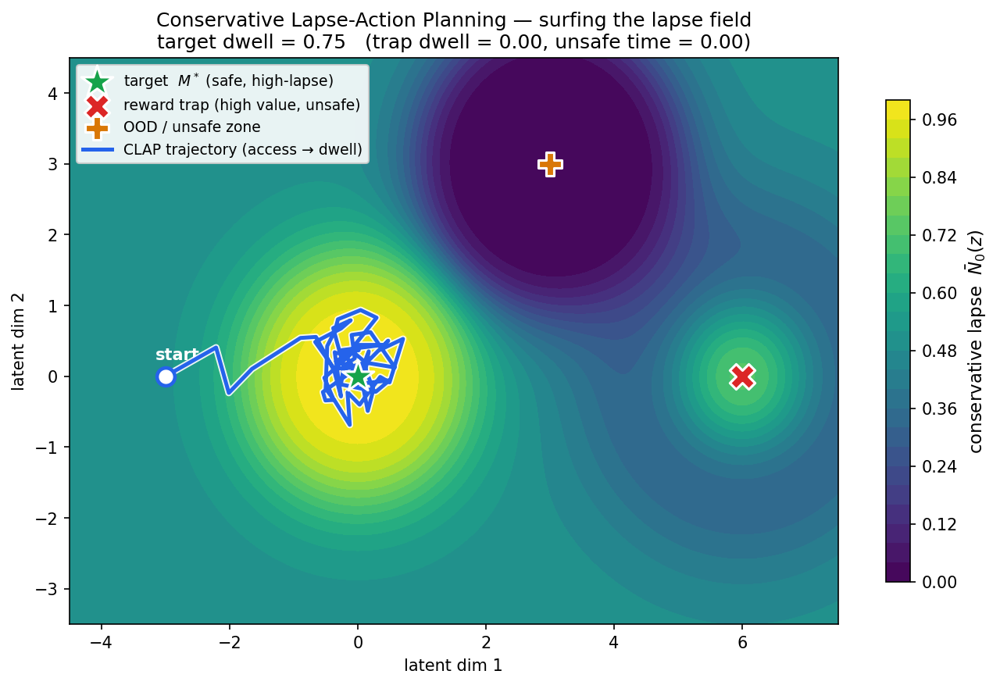
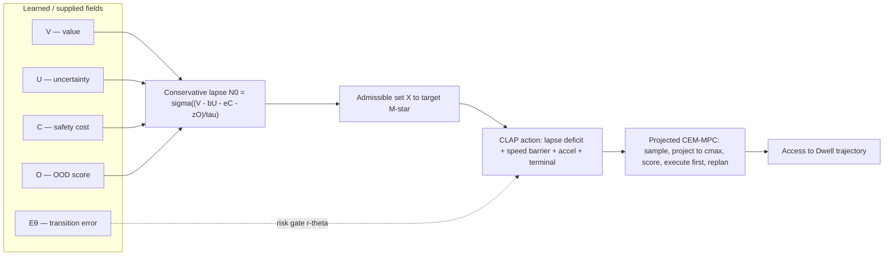
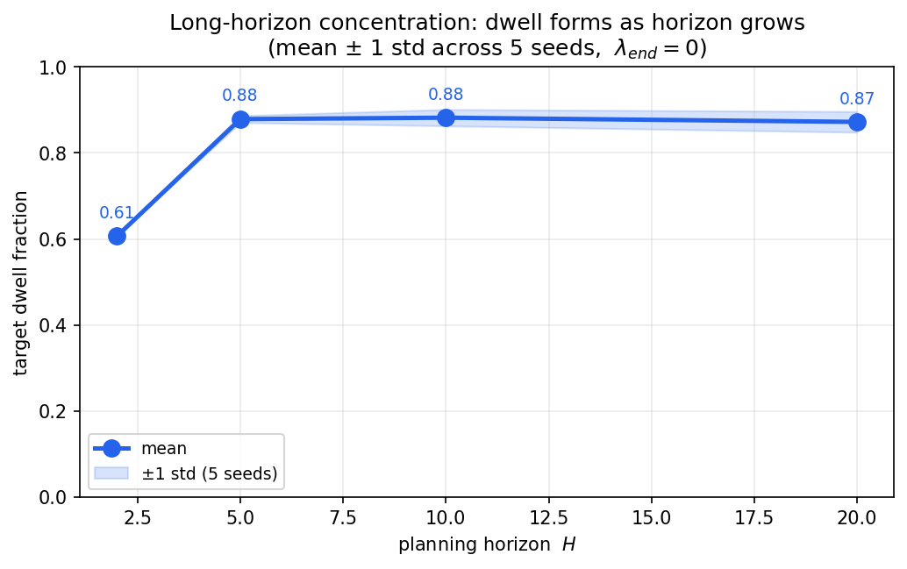
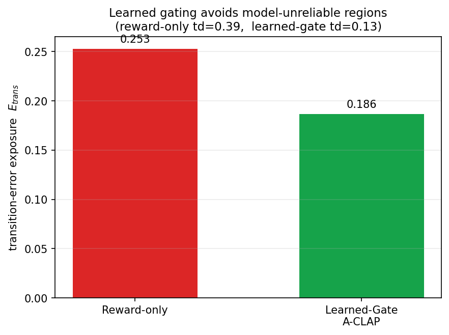

<div align="center">

# 🌊 clap_family

### Conservative Lapse-Action Planning — a variational *access-and-dwell* framework for safe AI optimization

*Don't just reach the reward. Safely **surf** the reliability landscape to the best reachable safe basin — and stay there.*

[](https://pypi.org/project/clap_family/)
[](https://www.python.org/)
[](LICENSE)
[](https://github.com/astral-sh/ruff)
[](tests/)
[](tests/test_theorem_contract.py)



*A real `clap_family` trajectory surfing the conservative-lapse field: it accesses the safe high-lapse basin (★) and dwells there, while ignoring the tempting reward **trap** (✗) and the **out-of-distribution** zone (✚).*

</div>

---

## Why this exists

Reward maximization is not a sufficient description of safe intelligent behavior. A planner can reach a high-reward state through an unsafe shortcut, exploit a region where its world-model is unreliable, oscillate between unstable states, or briefly touch a good target without remaining there long enough to be useful. In long-horizon control, robotics, autonomous navigation, embodied AI, and latent world-model planning, **safety is a property of the whole trajectory, not just the final state.**

**CLAP** replaces *"how much reward can I get?"* with *"can I reach the best admissible, reliable region without unstable or unreliable motion — and can I stay there?"* That is the **access-and-dwell** principle.

## The origin: from gravity-potential surfing to safe planning

This framework grew out of a simple physical picture. Studying how a body **surfs a gravitational potential** — following the geometry of a curved space, riding stable basins, governed by a scalar *lapse* field that sets how "time" flows along a worldline — suggested a reframing of safe planning.

What if an intelligent agent moved through its **latent state space** the same way? Not pulled blindly toward the steepest reward, but **surfing a conservative potential** that is high only where the future is genuinely trustworthy — valuable **and** certain **and** safe **and** in-distribution — flowing efficiently through reliable corridors and slowing near danger, finally settling into a stable safe basin.

CLAP makes that picture precise. The "potential" is a learned **conservative lapse field** `N̄₀`. The latent space carries a **Riemannian metric** `G` so distance reflects operational, not coordinate, cost. Planning becomes the minimization of a **variational action** — exactly the language of geodesics and least-action physics — whose minimizers provably **concentrate** in the best safe basin and **dwell** there. The name *lapse* is a direct nod to the scalar time-rate fields of geometric variational problems.

> The result is a *theorem-backed* safety–efficiency framework, not a heuristic. Six theorems (target existence, nonnegativity, zero-loss dwell, minimizer existence, long-horizon concentration, motion suppression) are shipped here **as executable tests**.

---

## Install

```bash
pip install clap_family                 # core (NumPy only — installs anywhere)
```

Optional extras for training integration and figures:

| Extra | `pip install` | Adds |
|---|---|---|
| Torch regularizer | `clap_family[torch]` | Differentiable `CLAPRegularizer(nn.Module)` |
| PyTorch Lightning | `clap_family[lightning]` | `CLAPRegularizationCallback` |
| HuggingFace | `clap_family[hf]` | `CLAPTrainerCallback` |
| RL (Gymnasium + SB3) | `clap_family[rl]` | `CLAPRewardWrapper` |
| Plots | `clap_family[plots]` | matplotlib (figure reproduction) |
| Everything | `clap_family[all]` | all of the above |

---

## Quickstart

```python
from clap_family import DUCLAP, ThreeRegionEnv, ProjectedCEMMPC
from clap_family import target_dwell, trap_dwell, unsafe_time

env = ThreeRegionEnv()                     # safe target · reward trap · unsafe zone
solver = ProjectedCEMMPC(samples=256, elites=32, iters=5, seed=0)

# Dynamic-Uncertainty CLAP: fast/abrupt motion lowers reliability
plan = DUCLAP(N_star=env.N_star, cmax=1.0, chi=2.0, omega=1.0, lambda_end=10.0)
traj = plan.plan(env, horizon=40, rollout=80, solver=solver)

print(f"target dwell: {target_dwell(traj, env):.2f}")   # → high
print(f"trap dwell:   {trap_dwell(traj, env):.2f}")      # → ~0
print(f"unsafe time:  {unsafe_time(traj, env):.2f}")     # → ~0
```

Prefer the paper's one-liner functional form? Every variant has a snake-case alias:

```python
from clap_family import du_clap, phase_adaptive_lg_a_clap, CLAPParams
J = du_clap(traj, env.fields, CLAPParams(N_star=env.N_star, chi=2.0, omega=1.0))
```

---

## How it works

A state is **high-lapse** only when it is valuable, certain, safe, and in-distribution. The conservative lapse field collapses four signals into one scalar:

```
N̄₀(z) = σ( ( V(z) − β·U(z) − η·C(z) − ζ·O(z) ) / τ )
```

where `V` = predicted value, `U` = epistemic uncertainty, `C` = safety cost, `O` = out-of-distribution score, `σ` = logistic squash. The planner targets the **best admissible high-lapse set** `M*` over the safe, reliable, admissible state class `X`, and minimizes a variational **action** along a latent trajectory `z(t)`:

```
A[z] = ∫₀ᵀ [ (N̄* − N̄₀(z))        ← lapse deficit    : reach the best safe basin
            + (κ/2)‖a‖²            ← acceleration     : suppress abrupt motion
            − γ·log(1 − q) ] dt    ← log speed barrier : never hit the latent speed limit
      + λ_end · d(z(T), M*)²       ← terminal         : end near the target manifold
```

with the normalized speed `q = ‖ż‖² / c(z)²`. Every term is nonnegative; the action is zero **iff** the trajectory sits on the target manifold at rest — that is the formal meaning of *dwell*.

### Architecture



---

## The variant family

CLAP is a *family*: each variant changes exactly one piece of the objective. They form a **safety–efficiency frontier**, not a single ranking.

| Variant | `import` | What it adds | Best for |
|---|---|---|---|
| **CLAP** | `CLAP` / `clap` | The clean theorem object | Default safe latent planning |
| **RRLA** | `RRLA` / `rrla` | Lapse realization decays with speed `÷√(1−q)` | Relativistic-speed analogies, theory |
| **DU-CLAP** | `DUCLAP` / `du_clap` | Uncertainty rises with speed & acceleration | High-risk systems where fast motion hurts reliability |
| **AdaptiveDU** | `AdaptiveDUCLAP` / `adaptive_du_clap` | Interpolates CLAP ↔ DU-CLAP | Mixed-risk environments |
| **A-CLAP** | `ACLAP` / `a_clap` | Risk-gate `r(z)` localizes conservatism | Reliable corridors near risky zones |
| **Learned-Gate** | `LearnedGateACLAP` / `learned_gate_a_clap` | Gate learned from transition-error `Eθ` | Model-based RL / learned world models |
| **Phase-Adaptive LG** | `PhaseAdaptiveLGACLAP` / `phase_adaptive_lg_a_clap` | Learned gate + access/dwell phase schedule | The strongest current synthesis |

**Strongest theorem object:** base `CLAP` (clean and tractable). **Strongest research candidate:** `PhaseAdaptiveLGACLAP` (combines learned model-error avoidance with access-phase efficiency and dwell-phase conservatism).

---

## Results (regenerated from this package)

<table>
<tr>
<td width="50%"></td>
<td width="50%"></td>
</tr>
<tr>
<td><b>Long-horizon concentration.</b> Once the planning horizon clears the access threshold, the planner reliably forms a stable dwell at the safe target (mean ± std over 5 seeds) — with trap and unsafe time at zero.</td>
<td><b>Learned gating works.</b> On a world-model with a hidden high-transition-error shortcut, a reward-only planner is drawn straight through it; <b>Learned-Gate A-CLAP</b> senses the unreliable region and detours — cutting transition-error exposure.</td>
</tr>
</table>

Regenerate them yourself:

```bash
pip install clap_family[plots]
python scripts/make_readme_figures.py        # writes docs/images/*.png
python -m clap_family.experiments.reproduce  # writes results.json (paper signatures)
```

---

## Integrate with modern AI training

CLAP is a **drop-in regularizer**, not a framework. The differentiable `CLAPRegularizer` recomputes the CLAP **running-cost action** (lapse deficit + speed barrier + acceleration penalty) over a batch of latent trajectories from your world model, so you can add it to any training loss and backpropagate:

```python
import torch
from clap_family.torch import CLAPRegularizer

# latent rollouts from your world model: (batch, horizon+1, latent_dim)
rollouts = world_model.rollout(states, actions)        # requires_grad=True

clap_reg = CLAPRegularizer(variant="du_clap", beta=1.0, gamma=0.5, kappa=0.1,
                           chi=2.0, omega=1.0, N_star=0.9,
                           value_head=v_net, uncertainty_head=u_net)  # heads optional

loss = task_loss + 0.1 * clap_reg(rollouts)            # penalizes fast/abrupt/uncertain latent motion
loss.backward()
```

First-class, lazily-imported adapters for the stacks you already use:

```python
from clap_family.torch import CLAPRegularizationCallback   # PyTorch Lightning Callback
from clap_family.torch import CLAPTrainerCallback          # HuggingFace transformers.Trainer
from clap_family.torch import CLAPRewardWrapper            # Gymnasium + Stable-Baselines3
```

Importing `clap_family` never requires torch — the adapters only load when you install the matching extra.

---

## Where CLAP fits

| Domain | Recommended variant |
|---|---|
| Model-based RL | Learned-Gate or Phase-Adaptive LG A-CLAP |
| Robotics | A-CLAP or Phase-Adaptive LG A-CLAP |
| Autonomous navigation | A-CLAP |
| Embodied AI | Learned-Gate A-CLAP |
| Industrial control | base CLAP or A-CLAP |
| Agentic LLM systems (conceptual) | Phase-adaptive gating — *move fast through routine steps, slow down near irreversible actions* |

**Honest framing.** CLAP is a rigorous planning objective, not a universal win or a complete safety guarantee. It provides a theorem-aligned safety structure and smoother long-horizon motion; strong conservative baselines can still outperform it on individual metrics, and the framework is only as good as the fields `V, U, C, O, Eθ` you give it (see paper §7 and [`docs/REPRODUCIBILITY.md`](docs/REPRODUCIBILITY.md)). The variants are a **frontier**, not a ladder.

---

## Project layout

```
clap_family/
  params.py geometry.py fields.py lapse.py admissible.py   # math core
  variants/        # BaseCLAP + 7 variants (each overrides one hook) + aliases
  solver/          # projected CEM-MPC
  envs/            # ThreeRegionEnv · HardEnv · TransitionErrorEnv
  metrics.py       # target_dwell · trap_dwell · unsafe_time · transition_exposure · jerk
  experiments/     # paper reproduction
  torch/           # optional: regularizer + Lightning / HF / Gymnasium adapters
tests/             # theorem contract: T1–T6 as executable tests
```

---

## Contributing

New variants, environments, backends, and training adapters are welcome — the extension points are small and documented. Adding a variant is usually one subclass overriding one hook, plus a reduction test. See **[CONTRIBUTING.md](CONTRIBUTING.md)**, which also lists open research directions (discrete-to-continuous convergence, moving-lapse tracking, stochastic & robust CLAP, multi-agent CLAP, learned latent metrics).

## Citation

```bibtex
@misc{patil2026clap,
  author = {Patil, Rishabh Ashok},
  title  = {Conservative Lapse-Action Planning: A Variational Access-and-Dwell
            Framework for Safe Latent Trajectory Optimization},
  year   = {2026},
  doi    = {10.5281/zenodo.20467271},
  url    = {https://doi.org/10.5281/zenodo.20467271},
  note   = {Zenodo}
}
```

## License

[MIT](LICENSE) © 2026 Rishabh Patil
